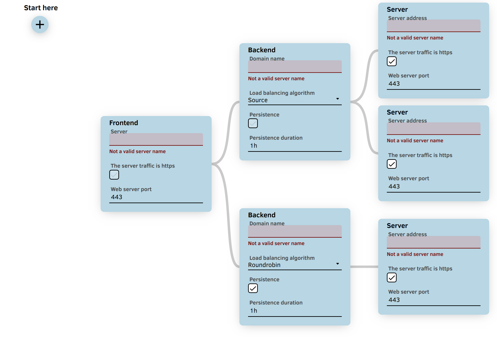

# `flowmaker` - A react component for creating a flow
This component makes it easy to create flows.  



## Example project
See [./example](./example)

## How to use
```sh
npm i mjarkk/react-flow-maker
```

```jsx
import FlowMaker from 'flowmaker'
import 'flowmaker/dist/flowmaker.css'
// ...
<FlowMaker
  logic={{
    introComponents: [],
    components: [],
  }}
  onChange={data => localStorage.setItem('flowMakerExample', JSON.stringify(data))}
  flow={JSON.parse(localStorage.getItem('flowMakerExample'))}
/>
```

#### `logic` **Required**
Logic discribes the blocks and the inputs they have  
It expects a object with the following properties.  
```js
let logic = {
  
  // These are the components that can be created from the 'Start Here' button
  // The names need to match the names of the components 
  introComponents: [
    'hello-world'
  ]

  // The blocks that can be made by a user
  // The first component (hello-world) shows the minimal inputs
  // The second component (wow) shows all the extra inputs that can be added
  components: [
    {
      name: 'hello-world'
      title: 'Hello World'
      inputs: [
        {
          name: 'exampleInput',
          title: 'Example input',
          type: 'text',
        }
      ],
      next: 'wow' // This can also be an array like: ['componentA', 'componentB', ...]
    },{
      name: 'wow'
      title: 'Wow'
      tooltip: 'wow blocks can also have tooltips',
      inputs: [
        {
          name: 'specialNumber',
          title: 'Special number',
          type: 'number', // This can also be: 'text', 'switch', 'dropdown'
          default: 1234,
          tooltip: 'Pssst the special number is 4321',
          validation: (_, input) => {
            return Number(input) == 4321 
              ? true
              : 'That\'s not the special number'
          },
        }, {
          name: 'options',
          title: 'Options',
          type: 'dropdown',
          default: 'c',
          options: [
            {title: 'A', value: 'a', tooltip: 'Wow options can also have tooltips'},
            {title: 'B', value: 'b'},
            {title: 'C', value: 'c'},
            {title: 'D', value: 'd'},
            {title: 'E', value: 'e'},
          ]
        }
      ]
    },
  ]
}
```

#### `onChange`
This returns a the flow data from when a user changes something

#### `flow`
Here you can add a flow to show when the drawing gets mounted, handy if you remove the component from the screen or when the drawing needs to be presistant.
